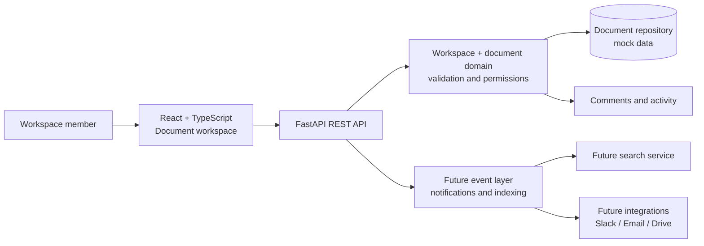

# Northstar Workspace Document architecture

## Request flow

1. A workspace member selects or edits a document in the React document workspace.
2. The frontend calls the FastAPI API for workspaces, documents, and comments.
3. The domain layer owns document validation, membership, and permission rules.
4. The repository currently serves mock documents in memory.
5. Comments and activity are kept as separate collaboration concerns.
6. The event layer, search, and external integrations are future extension points.

All current data is mock data. There is no database or external integration connected yet.
