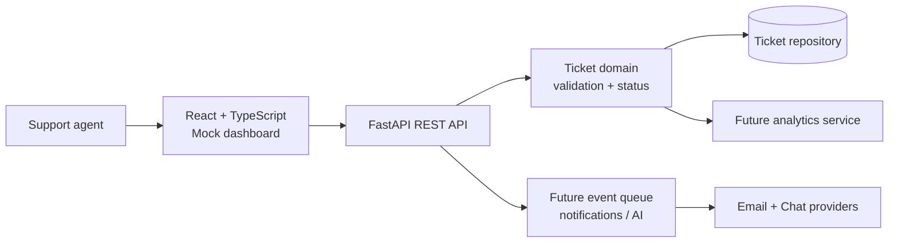

# SupportFlow architecture

The current skeleton keeps persistence in memory so the API and UI boundaries are easy to understand. A production implementation can replace the repository with Postgres without changing the route contract, then add authentication, background events, provider adapters, and AI-assisted classification behind the domain layer.
